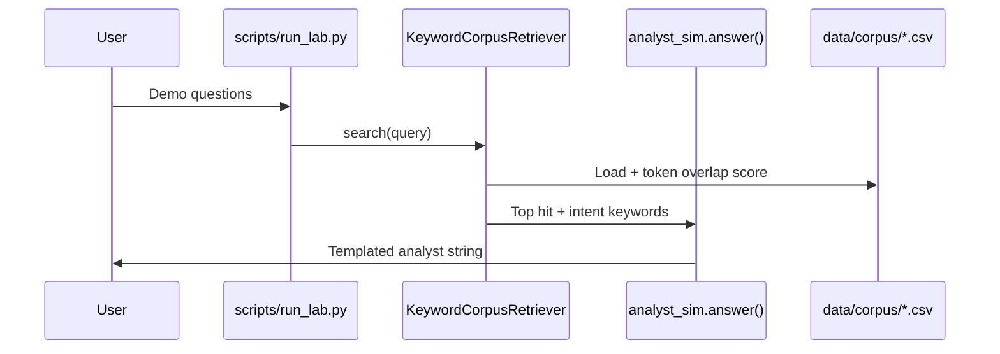
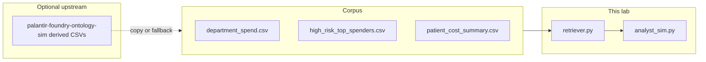
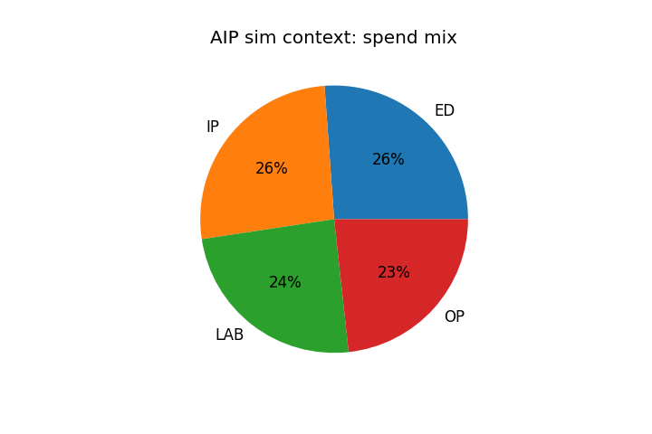

# Palantir AIP Analyst Simulation (Local)

**Author:** Faiz Elahi · **Type:** EDUCATIONAL LAB · **Data:** synthetic corpus CSVs

---

## Educational disclaimer / synthetic data

This project **simulates the shape** of a conversational analytics workflow (question → retrieve context → answer). It is **not** Palantir AIP, **not** an LLM product, and **does not** call OpenAI, Anthropic, or Foundry model APIs unless you optionally add your own guarded stub.

**No API keys are required** for the default path. Answers are **deterministic rule templates** driven by keyword overlap on CSV “documents.” All dollar amounts and patient IDs are synthetic.

Do not present this repository as proof of deploying AIP in a production Foundry tenant.

---

## Problem statement (detailed)

Analysts and executives increasingly ask **natural-language questions** over operational data: *“Which department spent the most?”* *“Who are our high-risk top spenders?”* In Foundry, **AIP Analyst** combines ontology grounding, permissions, and language models. Before touching paid services, students need a **safe local loop**:

1. Curate a **corpus** of small analytic tables (CSVs).
2. **Retrieve** relevant tables given a question (here: keyword scoring).
3. **Generate** an answer with explicit templates (stand-in for LLM generation).

This lab implements **retrieval + templated response** only—the “R” in RAG without the “G” from a live model. That lets you debug retrieval quality, discuss grounding, and compare against the ontology lab’s derived KPIs without cloud spend.

---

## Why this tool

- **Teaches RAG vocabulary** (corpus, chunk/document, retrieval, grounding) without GPU or API bills.
- **Pairs with ontology lab** — corpus files mirror `data/derived/` outputs from `palantir-foundry-ontology-sim`.
- **Interview-ready narrative** — You can explain exactly which parts are simulated and what you would add for production (embeddings, permissions, ontology object references).

Alternatives like “just ask ChatGPT” skip **data grounding** and **permission boundaries**—core concerns in enterprise analyst products.

---

## Architecture







See also: [`docs/architecture.md`](docs/architecture.md)

---

## Dataset dictionary (tables / columns)

Corpus location: `data/corpus/` (populated by `scripts/generate_synthetic_data.py`).

| File | Typical source | Columns | Description |
|------|----------------|---------|-------------|
| `department_spend.csv` | Ontology transform or fallback | `department`, `total_cost` | Aggregated spend by ED/IP/OP/LAB |
| `high_risk_top_spenders.csv` | Ontology transform or fallback | `patient_id`, `risk_tier`, `primary_site`, `encounter_count`, `total_cost_usd` | Top HIGH-risk patients by spend |
| `patient_cost_summary.csv` | Ontology transform or fallback | `patient_id`, `risk_tier`, `primary_site`, `encounter_count`, `total_cost_usd` | All patients with rollups |

The generator **copies** from `../palantir-foundry-ontology-sim/data/derived/` when present; otherwise it writes a **minimal fallback** synthetic corpus so the lab always runs standalone.

---

## Prerequisites

- Python 3.10+
- `pandas` (see `requirements.txt`)
- Recommended: run **`palantir-foundry-ontology-sim`** first so corpus matches full ontology pipeline outputs

---

## Step-by-step: how to run

### Windows PowerShell

```powershell
cd palantir-aip-analyst-sim
python -m venv .venv
.\.venv\Scripts\Activate.ps1
pip install -r requirements.txt
# Optional but recommended:
cd ..\palantir-foundry-ontology-sim
python scripts/generate_synthetic_data.py
python scripts/run_lab.py
cd ..\palantir-aip-analyst-sim
python scripts/generate_synthetic_data.py
python scripts/run_lab.py
python scripts/render_docs_images.py
```

### Optional bash

```bash
cd palantir-aip-analyst-sim
python3 -m venv .venv && source .venv/bin/activate
pip install -r requirements.txt
python scripts/generate_synthetic_data.py
python scripts/run_lab.py
python scripts/render_docs_images.py
```

### Expected console pattern

```
Q: Which department has the highest spend?
A: Template analyst response: highest department spend is ...

Q: Show high risk patient costs
A: Template analyst response: top high-risk patient P...
```

---

## File-by-file walkthrough

| Path | Purpose |
|------|---------|
| `scripts/generate_synthetic_data.py` | Builds `data/corpus/` from sibling ontology lab or fallback |
| `src/retriever.py` | `KeywordCorpusRetriever` — scores each CSV document by token overlap with query |
| `src/analyst_sim.py` | `answer()` — keyword intents (`department`, `high risk`) pick templates |
| `scripts/run_lab.py` | Runs demo questions through retriever + templates |
| `scripts/render_docs_images.py` | Generates `docs/images/spend_pie.png` |
| `docs/architecture.md` | Supplementary design notes |

**Flow:** corpus CSVs → retriever ranks files → `answer()` inspects query keywords and top hit filename → formatted string printed.

---

## Expected outputs and how to interpret them

| Output | Interpretation |
|--------|----------------|
| stdout Q/A pairs | Shows **which template fired**; compare when you change corpus ordering or filenames |
| `docs/images/spend_pie.png` | Visual mix of `department` totals — useful for slides, not clinical benchmarking |
| Corpus row counts | Should match ontology derived tables when sibling lab was run first |

If answers reference unexpected departments, inspect **retriever ranking** (token overlap) rather than assuming a model “hallucinated.”

---

## Results interpretation

- **Template answers are correct relative to corpus** — they are not independent reasoning. If corpus is stale, answers are stale.
- **Keyword retrieval** favors filenames and column text present in CSV string previews—production systems use embeddings + metadata filters.
- **High-risk path** triggers on `"high risk"` or `"risk"` substrings; department path on `"department"`, `"spend"`, or `"cost"`.

Use this lab to practice **explaining failure modes** (empty corpus, wrong table retrieved, ambiguous question).

---

## Glossary (8+ terms)

1. **AIP Analyst** — Foundry conversational analytics product; this repo is a teaching stub.
2. **RAG** — Retrieval-augmented generation; default lab implements **retrieval + templates** only.
3. **Corpus** — Collection of documents (here, whole CSV files treated as documents).
4. **Grounding** — Tying an answer to retrieved source data; templates cite synthetic values from CSVs.
5. **Intent routing** — Choosing answer logic based on query keywords (`department` vs `high risk`).
6. **Token overlap** — Simple scoring: count shared words between query and document text.
7. **Ontology grounding** — Production pattern linking answers to object types; not implemented here.
8. **Template** — Fixed response pattern with slots filled from DataFrame rows.
9. **Fallback data** — Generator-written corpus when sibling ontology outputs are missing.

---

## Common mistakes (5+)

1. Stating this uses **GPT or Foundry LLM** in the default configuration—it does not.
2. Running **`run_lab.py` before `generate_synthetic_data.py`** with an empty corpus directory (fallback mitigates but sibling copy is richer).
3. Expecting **multi-turn memory** — each question is stateless.
4. Renaming corpus files without updating **retriever logic** that checks substrings like `"high_risk"` in filenames.
5. Using synthetic dollar figures in **real financial decisions**.
6. Skipping **disclaimer** in portfolio README—recruiters appreciate precise simulation labels.

---

## Exercises (5+)

1. Add **BM25** scoring (optional dependency `rank-bm25`) and compare rankings vs token overlap.
2. Add a third intent: **patient count by site** using `patient_cost_summary.csv`.
3. Log **retrieval scores** to CSV for offline evaluation.
4. Wire optional `OPENAI_API_KEY` module in `llm_stub`-style file guarded by `ENABLE_LIVE_LLM=0` default.
5. Pass **object type names** from ontology YAML into document metadata for teaching grounding.
6. Write unit tests for `answer()` given frozen corpus fixtures.

---

## Limitations / simulation vs production

| This lab | Production AIP / analyst stack |
|----------|----------------------------------|
| Keyword overlap | Embeddings, hybrid search, rerankers |
| CSV files on disk | Ontology objects with ACLs |
| Public templates | LLM with policy filters |
| No chat history | Sessions, follow-ups, clarifications |
| No API keys | Tenant auth, model routing, cost controls |

---

## Related labs

- [`palantir-foundry-ontology-sim`](../palantir-foundry-ontology-sim/) — Produces derived KPI CSVs used as corpus input.
- [`langchain-langgraph-analyst-lab`](../langchain-langgraph-analyst-lab/) — Graph-shaped analyst with freshness gate.
- [`dbt-healthcare-marts-lab`](../dbt-healthcare-marts-lab/) — SQL-tested marts instead of CSV corpus.
- [`apache-superset-dashboard-as-code-lab`](../apache-superset-dashboard-as-code-lab/) — Dashboard artifacts as code.

---

**Author:** Faiz Elahi · Educational use only.
