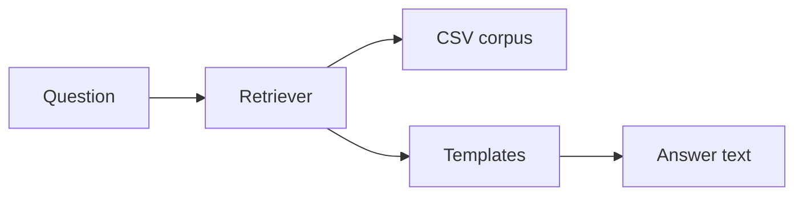

# AIP Analyst Sim Architecture

Local retrieval + templates only. See root README.

```mermaid
flowchart LR
  Q[Question] --> R[Retriever]
  R --> C[CSV corpus]
  R --> T[Templates]
  T --> A[Answer text]
```
